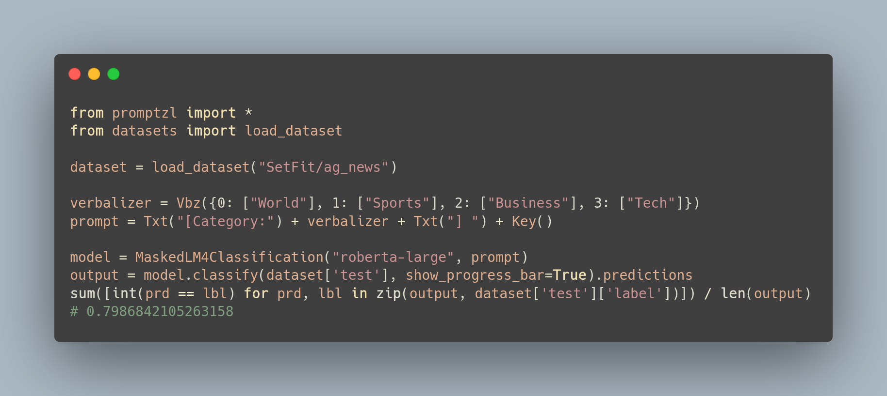

Promptzl Documentation
======================

Turn state-of-the-art LLMs into zero-shot PyTorch classifiers in just a few lines of code.

Promptzl offers:
   - 🤖 Zero-shot classification with LLMs
   - 🤗 Turning `causal <https://huggingface.co/models?pipeline_tag=text-generation>`_ and `masked <https://huggingface.co/models?pipeline_tag=fill-mask>`_ LMs into classifiers without any training
   - 📦 Batch processing on your device for efficiency
   - 🚀 Speed-up over calling an online API
   - 🔎 Transparency and accessibility by using the model locally
   - 📈 Distribution over the classes
   - ✂️ No need to extract the predictions from the answer.

Links
-----

 .. centered::
   `GitHub <https://github.com/LazerLambda/Promptzl>`_ | `PyPI <https://pypi.org/project/promptzl>`_ | `GitHub Issue Tracker <https://github.com/LazerLambda/Promptzl/issues/new>`_

Installation
------------

.. code-block:: bash

   pip install -U promptzl

How does it Work?
-----------------

Language models predict a token given a specific context by calculating a distribution over the vocabulary.
When classifying sentences, only a few tokens are relevant for the classification task. Extracting the tokens'
logits and forming a distribution over them allows turning the LLM into a classifier. This is what Promptzl does.
A simple example can be found in:ref:`tutorial_tldr`.

Background
----------
.. toctree::
   :maxdepth: 1

   background

Documentation
-------------

.. toctree::
   :maxdepth: 1

   prompt
   lm_classifiers
   utils

Tutorials
---------

.. toctree::
   :maxdepth: 1

   tutorial_init
   tutorial_causal_lms.rst
   tutorial_masked_lms.rst
